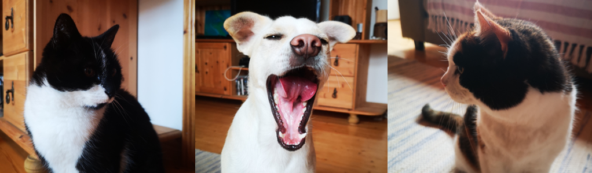

# Pet Feeder

## Table of Contents
1. [Overview](#overview)
2. [Project Background](#project-background)  
2. [Business Requirements](#business-requirements)
3. [Hypotheses](#hypotheses)
4. [Rationale for the Data Visualization task](#rationale-for-the-data-visualization-task)
5. [Rationale for the ML model task](#rationale-for-the-ml-model-task)
6. [ML Business case](#ml-business-case)
7. [ML Model Development](#ml-model-development)
    - [Basic architecture](#basic-architecture)
    - [Hyperparameter tuning](#hyperparameter-tuning)
    - [Input Data](#input-data)
    - [Trial and error](#trial-and-error)
    - [Final model](#final-model)
        - [Detailed results for Test images](#detailed-results-for-test-images)
        - [Detailed results for Live images](#detailed-results-for-live-images)

8. [Hypotheses - Considerations and Validations](#hypotheses---considerations-and-validations)
    - [Visual Differentiation Hypothesis](#visual-differentiation-hypothesis)
    - [Deep Learning Classification Hypothesis](#deep-learning-classification-hypothesis)
9. [Design document](#design-document)
10. [CRISP-DM Process](#crisp-dm-process)
11. [Bugs and Issues](#bugs-and-issues)
12. [Deployment](#deployment)
13. [Technologies](#technologies-used)
14. [Credits](#credits)

## Overview

This project is ...

**[Deployed version of PetFeeder on Heroku](https://pet-feeder-2c5140da1298.herokuapp.com/)**

[📸 Live images](https://drive.usercontent.google.com/u/0/uc?id=1M4vruKofgkxSTwYd1FCdtoajfvmZFP6Y&export=download)

[💾 Train, Test, Validation datasets](https://drive.usercontent.google.com/download?id=1jDeB3UaS86FiSKJnJ4Q5-n01PZ2Fq-zr&export=download)

## Project background
For many people, pets are an important part of their lives. However, some people struggle to keep track of all their pets' needs due to an irregular work schedule or their own health issues.
Moreover, pet obesity has increased dramatically over the past decade, with up to 60% of all pets meeting the criteria of being obese, according to a [study by APOP](https://veterinairepetcare.com/blog/key-pet-obesity-statistics-facts-2023.html).
One of the reasons for pet obesity is overfeeding.

To lighten the pet owners' burden while ensuring the pets' wellbeing, the client is building an **automated food dispenser for pet animals**. The product is targeted towards owners with two or more visually distinguishable animals.

The product will ensure that each pet that comes up to the feeder receives the correct type and amount of food at preset intervals, allowing the pet owner to adjust the pets' diets in accordance with the veterinarian's advice.

To this end, the product will be equipped with a motion sensor and a camera that will take a series of snapshots whenever it detects movement. The camera will take three pictures per second. The device software will then run the images against a pretrained model, deciding which pet has triggered its activation.

In case of a successful classification, it will proceed to dispense food and record the interaction for further assessment.

## Business Requirements

The primary objective of this project is the development and deployment of a **proof-of-concept tool** with a Deep Learning model for image classification at its core. The tool will prove or disprove the feasibility of the client’s own business idea and present them with a practicable framework for prototyping.

The stakeholders in this case are the client, expecting insights they can act on, as well as the future users of the product, who will have to rely on its accuracy.
The client’s requirements are:
-	**Speed and scale**: The prediction mechanism will be integrated into the standalone device and will have to function offline. The device will presumably be built around a single-board computer such as the Raspberry Pi Multiple and predictions have to be made in real-time. Thus, small model size and high prediction speed are of the essence.

-	**Reliability**: The classification tool based on the model must be able to always recognize a pet within a certain amount of time and cancel a classification following inconclusive results.

-	**Automation**: Using image comparison metrics, the tool should be able to assess whether a collected training set will serve as a solid basis for model training and make recommendations to the pet owner.

-	**Reproducibility**: The model architecture should be adaptable to new training datasets so that each pet owner can train the device to recognize their own pets.

It was agreed upon in consultation with the client that for the purposes of this PoC tool, the focus will be on developing a reasonably sized, reliable model based on one specific dataset consisting of **three classes**, and that the possibility of predicting the model’s future performance with the help of image comparison will be investigated.

This agreement results in the following 3 business requirements:

---
1.	The client is interested in a recommendation regarding the scale and quality of future datasets as well as an investigation of a correlation between the similarity of the pets' visual features and the performance of the model. 

    

    
The client's questions

    - _How do we know what kind of images to take and how many we need?_
    
    - _Is the background important?_

    - _What if the pets look very much alike?_

    

---

2.	The client is interested in an F1 score > 0.9 for each label.

    

    
The client's questions

    - _Can we make sure that the device has a good grasp on what each pet looks like and does not just make wild guesses?_

    

---

3.	The client would like to investigate the possibility of an infallible process during which a pet will be either classified correctly or not classified at all.

    

    
The client's questions

    - _Is it possible to guarantee our customers that one pet will not get all the food of the other pets?_

    

---

To assess the project’s outcome, the client would like a full report in the form of an online dashboard.

The dashboard will present the client with the findings and explain their relevance. The dashboard will also allow the client to test the functionality of image classification with a downloadable live data set.

## Hypotheses

To answer each business objective, the following hypotheses need to be validated:

1.	It is assumed that an assessment of image data prior to training can determine weak points in a training set.
    - To validate, the images in each label will be analyzed visually as well as using Mean and Variance. While this process cannot be automated, it can serve as a basis for instructions given to the pet owner to assist them in their training data collection process.

2.	It is assumed that an assessment of image data prior to training can predict which labels will be hardest to distinguish.
    - To validate, the images in each label will be analyzed using Mean, Variance, and histogram comparison. The methods Correlation, Chi-Squared, Intersection, Bhattacharyya, and Euclidean Distance will be applied to translate the histogram comparison results into similarity values. These values will be the basis of our prediction regarding the tendency of the model to confuse certain labels. After the actual training, a confusion matrix analysis will corroborate or disprove our prediction.

3.	An F1 score of > 0.9 for test and live data is possible for each label.
    - While the validation will only apply to the provided dataset, it will nevertheless prove the possibility of achieving the target score with a small-scale model and a rather limited amount of image data.
    - To validate, a model architecture suited for multi-class image classification will be chosen and a tuner will be used to find the best hyperparameters. The model will then be trained with those parameters and used to classify all the available test and live data separately. A classification report will then yield the F1 scores for each label. This process will be repeated until the target score has been reached.

4.	It is assumed that it is possible to reduce the risk of misclassifying a pet by letting the model make a summary prediction for a batch of images instead of trying to classify a pet based on one single image. It is also assumed that a minimum threshold value is needed for the number of images to be batched before the first classification attempt should be made.
    - To validate, we will conduct a series of trials where the model will make predictions for batches of 2+n random live images for each label. We will then show the results in a confusion matrix and a classification report to see whether we have achieved an F1 score of 1 for each label. If successful, 2+n will be the recommended minimum number of images per classification batch.

## Rationale for the Data Visualization task

### Business Requirement 1: Data Assessment

- Objective: Find a way to assess the image data, determine similarities between labels and visualize the results in an informative manner.
- Action: Convert the images into a format that can be used in ML and visualization tasks.
- Task: Process and compare images using histogram comparison methods. Visualize and interpret the results.

    **Relevant user stories:**

    •	As a client, I can consult the interactive online dashboard so that I can view and understand the image data.

    - A Streamlit dashboard presents the labelled, analyzed data in a clear manner.

    •	As a client, I can read explanatory texts so that I can understand the significance of each analysis.

    - Informational texts interpret the visual data and explain the meaning of graphs and values.

    •	As a client, I can read a conclusion so that I can come away with clear instructions as to how procure adequate datasets.

    - A summary on the "Data Assessment" page provides clear recommendations based on the performed analyses.

## Rationale for the ML model task

### Business Requirement 2 & 3: Classification

- Objective: Build an ML model that can accurately predict the pets in the dataset and present it to the client.
- Action: Tune and train multiple models on the dataset at hand,
- Task: Evaluate the performance of each model, devise tests to make sure the model complies with the client's requirements, and present recommendations to the client.

    **Relevant user stories:**

    • As a client, I can upload one or more images to the dashboard so that I can run the ML model and receive a classification of the provided images.
    - After choosing all relevant parameters on the “Image Classifier” page of the dashboard, the client can use the upload widget to add .png images in bulk or individual batches and start the classification process. The results of the classification are shown in real-time, allowing the client to understand what the model is doing in the background.
    
    • As a client, I can save model predictions in a timestamped CSV file so that I can run my own tests and document them.
    - A download button at the bottom of the classifier page triggers the download of a csv file with all tables in the analysis report.

    • As a client, I can consult the report on the model performance results so that I can understand whether it is suited to my business idea.
    - The page "ML Performance Metrics" of the Streamlit dashboard contains all the information on the model setup, its performance and the calculated parameters for its desired performance in real-world applications. 

## ML Business Case

- The client requires a Deep Learning model that will correctly classify an unspecified number of pets within a few seconds of receiving their images.
- The model will be based on the provided images of three pets and will serve as Proof of Concept in the client’s product development process.
- The model will be built as a sequential multi-class CNN model with an architecture typical for image classification.
- The ideal outcome is a model sized < 20MB than can rapidly and correctly identify a stream of pet images provided by an image generator (such as a camera or a batch of uploaded images) in under 15 images.
- The metrics used to judge the model’s performance are:
    -	the F1 score with a target value of > 0.9 for each label during individual prediction and a target value of 1 for each label batch during batch classification tasks
    -	summary values from detailed reports on pet (mis)classification for live data
    -	the Accuracy and Loss curves showing the model’s handling of the train and validation data

- The input will be .png RGB images with the dimensions 128x128px.
- The output will be a list of probability values that will be mapped to the class labels to determine which class was given the highest probability value.
- A recommendation regarding the minimum and maximum number of images needed for an accurate classification as well as a reasonable confidence threshold will be given after running extensive trials and evaluating the results.
- We will consider the model successful if it correctly classifies any given pet during the trials and live operation with the recommended parameters and refrains from a final classification when given a batch with mixed classes.
- We will consider it a failure if it causes the device to give food to the wrong pet more than 1 time within 12 months of operation.
We will also consider it a failure if it fails to recognize a pet with the agreed-upon confidence after having received a steady stream of 15 viable images.

## ML Model Development

The model is a Deep Learning Convolutional Neural Network (CNN) built with Keras, a high-level API for Tensorflow. The CNN model uses the Softmax regression as the output layer activation function and the default ReLU activation function for all other layers.

The optimal amount of filter layers and filter values as well as the number of neurons was chosen after the hyperparameter tuning with keras-tuner.

Categorical cross-entropy, which is suitable for multi-class classification, was used as the loss function, while Adam, being an efficient and resource-friendly algorithm, was used as the optimizer.

### Basic architecture

- Input shape: 128, 128, 3
- Model type: Sequential

| Layers | Content |
| --- | --- |
| InputLayer | (128, 128, 3) |
| Conv2D | filters=128, kernel_size=(5, 5), activation="relu", kernel_regularizer=l2(0.0001) |
| MaxPooling | pool_size=(6, 6) |
| Conv2D | filters=128, kernel_size=(3, 3), activation="relu", kernel_regularizer=l2(0.0001) |
| MaxPooling | 	pool_size=(2, 2) |
| Conv2D | filters=128, kernel_size=(3, 3), padding="same", activation="relu", kernel_regularizer=l2(0.0001) |
| MaxPooling | pool_size=(2, 2) |
| Flatten | --- |
| Dense | 384, kernel_regularizer=l2(0.0001) |
| Dropout | 0.3 |
| Dense(output) | 3, activation="softmax" |

- Compiling: 
    - loss="categorical_crossentropy"
    - optimizer=keras.optimizers.Adam(learning_rate=0.001)
    - metrics=["accuracy"]
	

### Hyperparameter tuning

An instance of keras_tuner.HyperParameters was used to set the value ranges for the layers, the regularizer and the optimizer. The addition of the third Conv2D and MaxPooling layers as well as the second Dense and Dropout layers was optional.

| Layer/metric | Ranges |
|---|---|
| Conv2D | "filters_1", min_value=32, max_value=256, step=32 |
| Conv2D | "filters_2", min_value=32, max_value=256, step=32 |
| (Conv2D) - _optional_ | "filters_2", min_value=32, max_value=256, step=32 |
| Dense | "dense_units_1", min_value=128, max_value=2048, step=64 |
| Dropout | "dropout_1", min_value=0.2, max_value=0.6, step=0.1 |
| (Dense) - _optional_ | "dense_units_2", min_value=64, max_value=256, step=32 |
| (Dropout) - _optional_ | "dropout_2", min_value=0.2, max_value=0.6, step=0.1 |
| learning_rate | values=[1e-1, 1e-2, 1e-3, 1e-4] |
| kernel_regularizer | values=[1e-2, 1e-3, 1e-4] |
| kernel_1 _(for first Conv2D layer)_ | 3-6 |
| pool_1 _(for first MaxPooling layer)_ | 2-5 |

At first, the tuner was initialized with keras_tuner.RandomSearch, which was later replaced with keras_tuner.BayesianOptimization, hoping for a more effective and thus less resource-intensive tuning process.

- Tested batch sizes: 32, 64
- Tuner max_trials: 20
- Epochs: 20-30

### Input Data

As input data, the tuner received the X_train array with the augmented and balanced train images and the one-hot encoded y_train labels array.

Early experiments showed that preserving the RGB channels instead of converting the images to grayscale led to a slightly better model performance. Adding a small amount of gaussian noise using the function np.random.normal() around a mean of 0 and a spread of 0.03 resulted in about 1-2% higher F1 scores.

While it might seem counterintuitive to make image data noisy, it can help the model generalize by forcing it to ignore the noise and focus on repeating patterns and features, thereby preventing overfitting ([Reference](https://machinelearningmastery.com/train-neural-networks-with-noise-to-reduce-overfitting/)).

### Trial and error

**Tuning process**

Most of the tuning was done in a [Google Colab](https://colab.research.google.com/) notebook using the limited free access to the T4 GPU. This resulted in sufficiently fast tuning, partly thanks to the rather small size of input data that was provided.

The best hyperparameters from each tuning session were then used to train a model.

**Amount of layers**

By analyzing the tuner results and further testing, it became apparent that **three Conv2D/MaxPooling layers** were performing better than two, and that **one hidden Dense layer** was the best choice.

**AMount of neurons**

Models using between 1024 and 2048 neurons were unnecessarily large and usually overfitting, and the models that were judged to be among the best had a neuron number of 384 (as suggested by the tuner early on).

**Kernel and pool sizes**

Increasing the kernel and pool sizes in the first Conv2D/MaxPooling2D layers to 5 and 6 respectively (as suggested by the tuner) led to better-performing models with much better scores on live data. Larger kernel and pool sizes tend to be better for capturing more global features as opposed to small details, which coincides with our goal to recognize three distinct shapes with no need for finder details.

The larger pool size also helped reduce the overall model size.

**Regularization**

After several trials, an L2 kernel regularizer was added to all hidden layers, with a range of 0.01 to 0.00001 to test. The addition of the regularizer, which penalizes the weight sizes, was meant to help avoid overfitting.

**Batch size**

Using 64 as batch size during model fitting tended to worsen overfitting. Reducing it to 20 led to worse live data classification, as did a batch size of 40.

**Smoothen the curves**

An attempt was made to adjust certain parameters of the best-performing model and train on the same pre-saved dataset to see if we could smoothen the craggy Acc/Loss curves of the original:

The attempts did lead to top scores for test image classification (almost all > 0.95) but yielded poor results for live images (with most values < 0.9, some < 0.8).

| Model version | Changes | Graphs |
|--|--|---|
| x_b_1_retrained | - Added padding="same" to Conv2D layers 1 and 2   - Changed all "MaxPooling2D" layers to "AveragePooling2D"   - Removed L2 kernel regularizer | 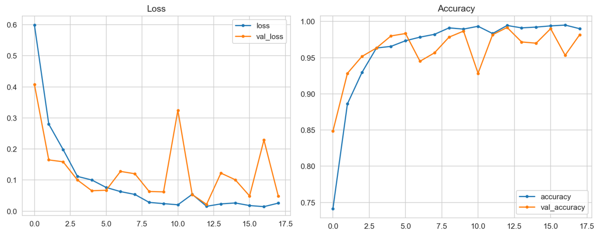 |
| x_b_1_retrained_2 | - Added L2 kernel regularizer 1e-05 to all hidden layers   - Changed second and third "AveragePooling2D" layers back to "MaxPooling2D"   - Reduced Dropout of the hidden Dense layer from 0.3 to 0.2 | 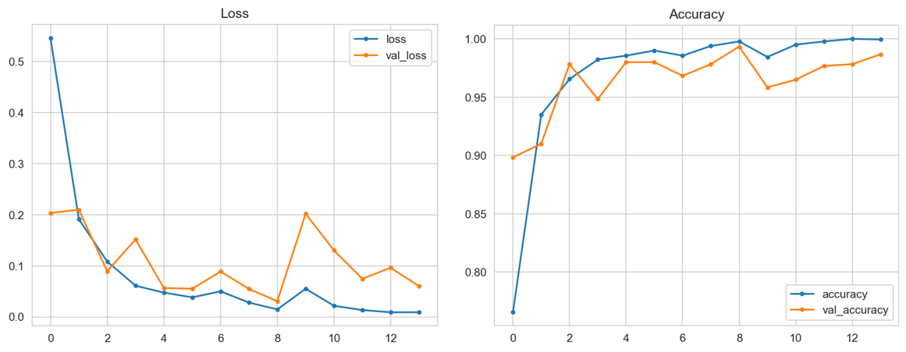 |
| x_b_1_retrained_3 | - Changed first "AveragePooling2D" layer back to "MaxPooling2D"   - Increased L2 kernel regularizer to 1e-03 for all hidden layers   - Increased  Dropout of the hidden Dense layer from 0.2 to 0.4   - The only differences between this model and the top model are that is uses padding="same" instead of "none" and a Dropout rate of 0.4 instead of 0.3 | 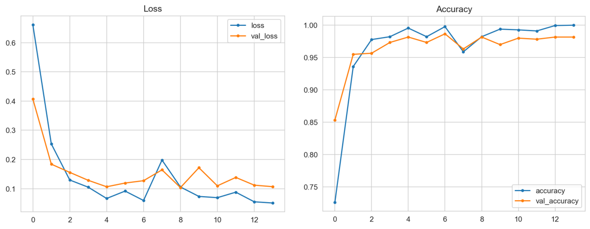 |
| x_b_1_retrained_4 | - Reduced first Conv2D layer kernel size from (5, 5) to (4, 4)   - Reduced first MaxPool2D pool size from (6, 6) to (5, 5)   - Reduced Dropout of the hidden Dense layer from 0.4 to 0.3| 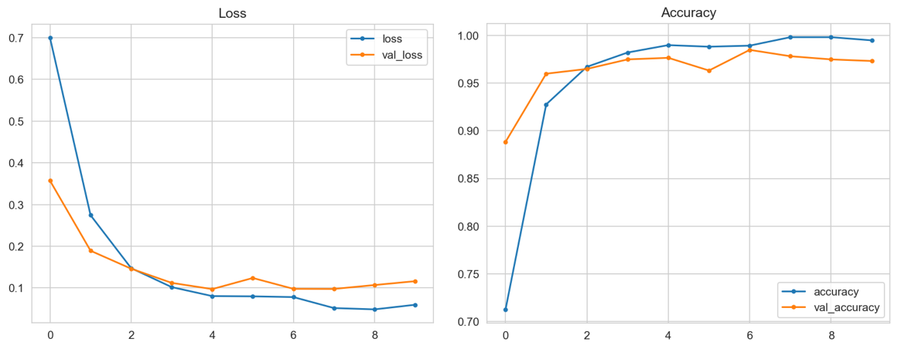 |

| Model version | Test data scores | Live data scores |
|---|---|---|
| x_b_1_retrained | 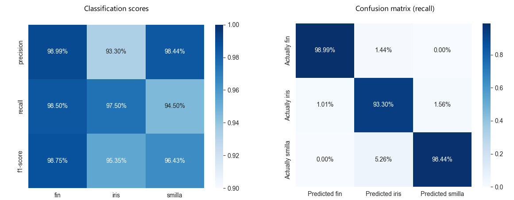 | 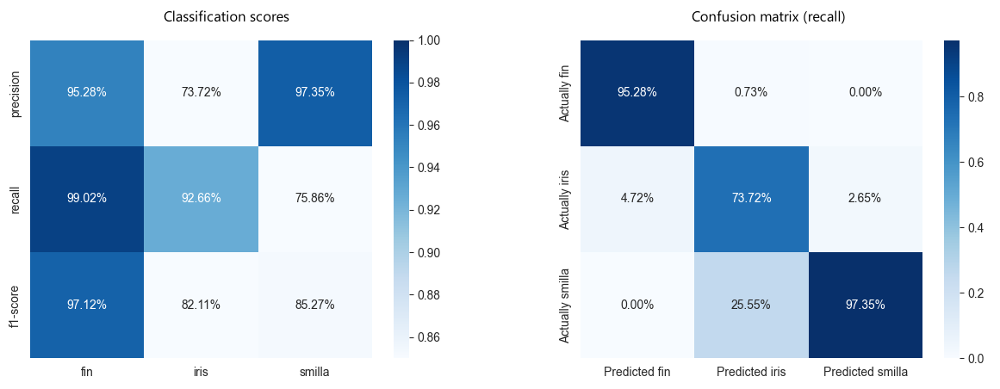 |
| x_b_1_retrained_2 | 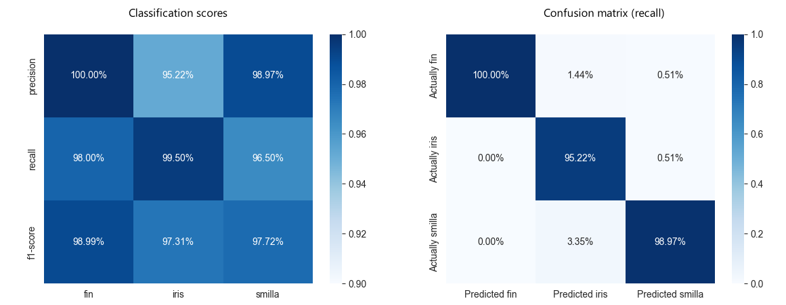 | 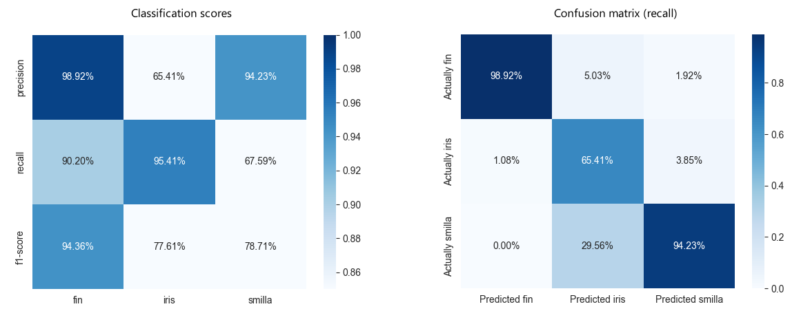 |
| x_b_1_retrained_3 | 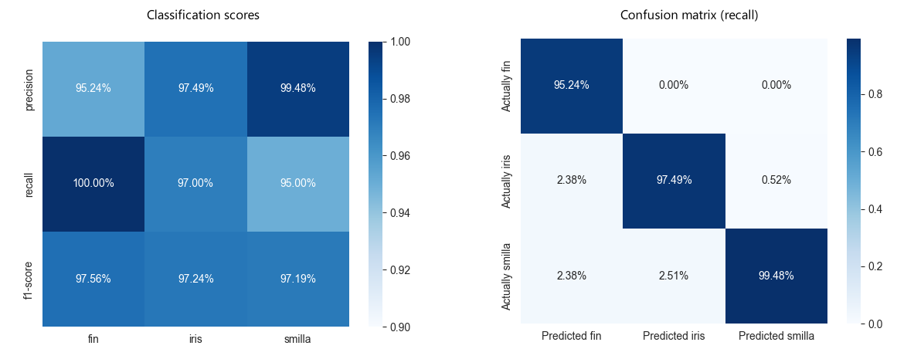 | 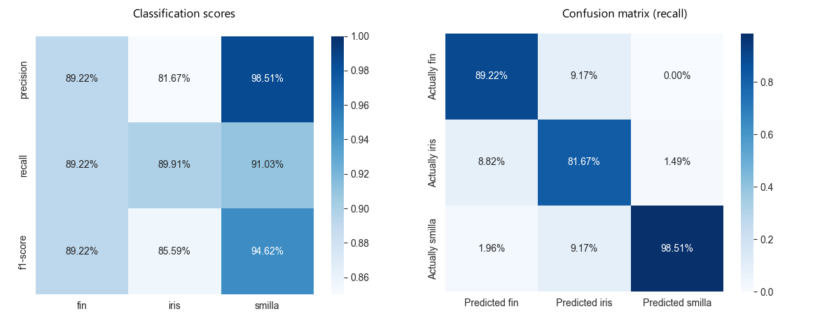 |
| x_b_1_retrained_4 | 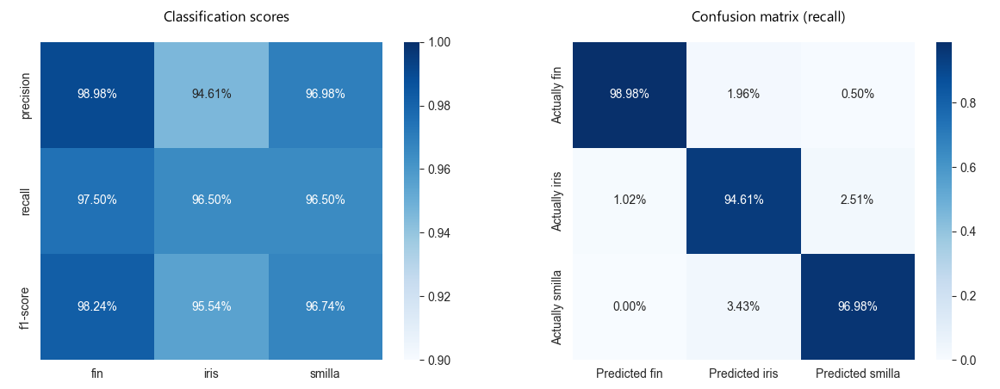 | 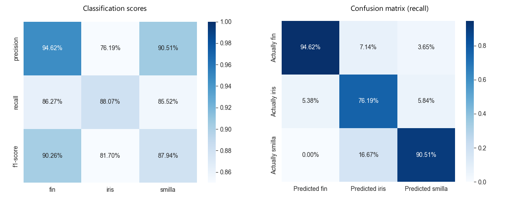 |

### Final model

To summarize, extensive tuning and experimenting lead to the following parameters which constitute the model that was judged to be the top performer:

        hyperparams = {'kernel_1': 5, 'filters_1': 128, 'pool_1': 6,
                        'filters_2': 128, 'filters_3’: 128,
                        'dense_units_1': 384, 'dropout_1': 0.3,
                        'learning_rate': 0.001, 'kernel_reg': 0.0001}

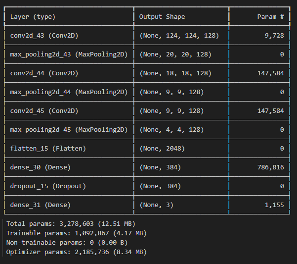

| Loss | Accuracy |
|---|---|
| 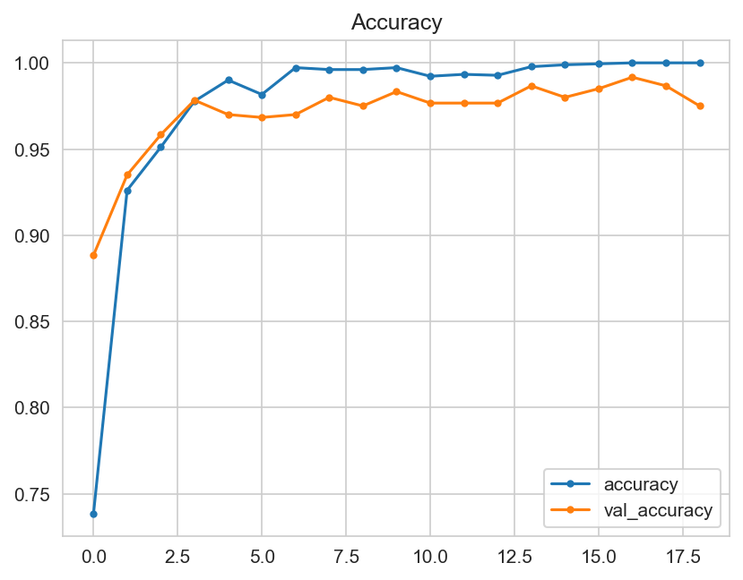 | 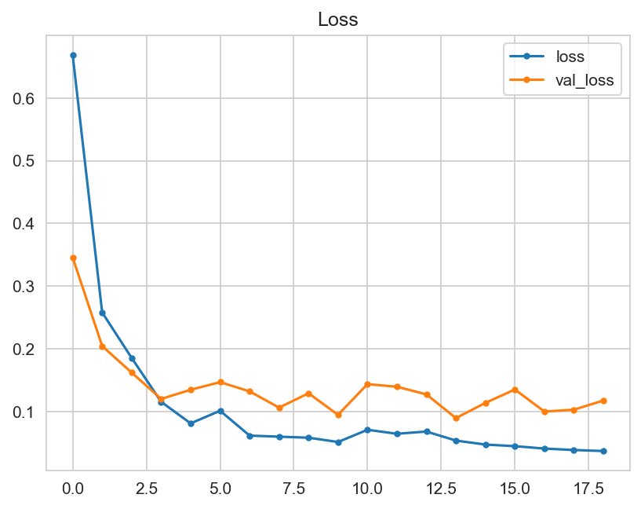 | 

 Despite uneven val_loss and val_accuracy curves pointing to some overfitting, the F1 scores were exceptional: 0.99, 0.98 and 0.97 for the test set and 0.99, 0.94 and 0.96 for the live set.

| Test scores | Live scores |
|---|---|
| 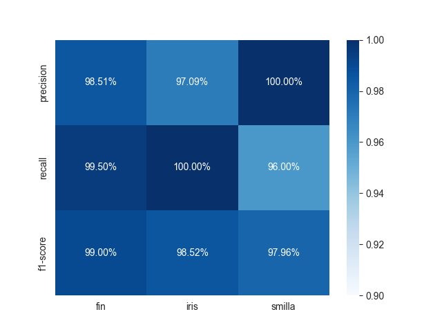   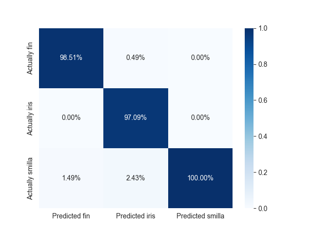 | 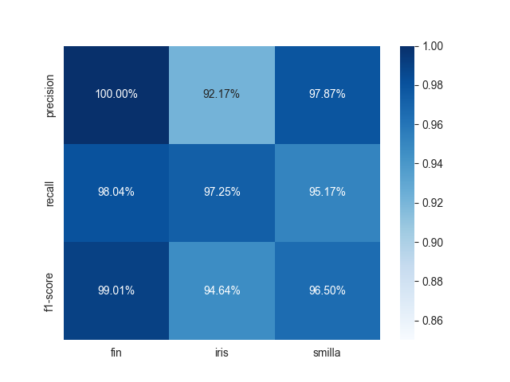    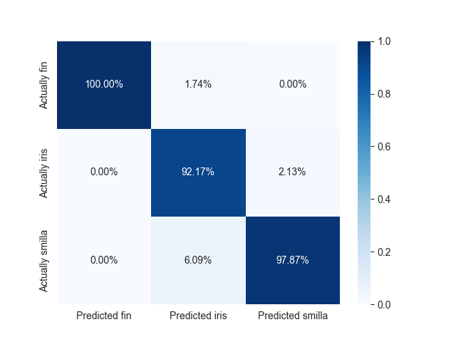 |

<b>Detailed Logs</b>

#### Detailed results for Test images

**Confusion matrix:**

                     Predicted fin  Predicted iris  Predicted smilla
    Actually fin               199               1                 0
    Actually iris                0             200                 0
    Actually smilla              3               5               192

**Classification report:**

                   precision    recall  f1-score   support

             fin       0.99      0.99      0.99       200
            iris       0.97      1.00      0.99       200
          smilla       1.00      0.96      0.98       200

        accuracy                           0.98       600
       macro avg       0.99      0.98      0.98       600
    weighted avg       0.99      0.98      0.98       600

#### Detailed results for Live images

**Live data stats:**

            Image amount
    fin           102
    iris          109
    smilla        147

**Confusion matrix:**

                     Predicted fin  Predicted iris  Predicted smilla
    Actually fin            100               2                 0
    Actually iris             0             106                 3
    Actually smilla           1               7               139

**Classification report:**

                   precision    recall  f1-score   support

             fin       0.99      0.98      0.99       102
            iris       0.92      0.97      0.95       109
          smilla       0.98      0.95      0.96       147

        accuracy                           0.96       358
       macro avg       0.96      0.97      0.96       358
    weighted avg       0.96      0.96      0.96       358

----

**Analyzed 750 images per label in total: 50 batches, 15 images per batch:**

Errors during **individual image** classification:

    Misclassified as    |       FIN         IRIS       SMILLA
    -----------------------------------------------------------
      iris              |      14.0          nan         48.0
      smilla            |       nan         16.0          nan
      fin               |       nan          nan          3.0

Errors during **batch** classification:

Confusion matrix: 

                    Predicted fin  Predicted iris  Predicted smilla
    Actually fin                50               0                 0
    Actually iris                0              50                 0
    Actually smilla              0               0                50

Classification report: 

                precision    recall  f1-score   support

             fin       1.00      1.00      1.00        50
            iris       1.00      1.00      1.00        50
          smilla       1.00      1.00      1.00        50

        accuracy                           1.00       150
       macro avg       1.00      1.00      1.00       150
    weighted avg       1.00      1.00      1.00       150

**Analyzed 1500 images per label in total: 500 bacthes, 3 images per batch**

Errors during **individual** image classification:

    Misclassified as    |     FIN         IRIS       SMILLA
    ----------------------------------------------------------
      iris              |    36.0          nan         70.0
      smilla            |     nan         39.0          nan
      fin               |     nan          nan          7.0

Errors during **batch** classification:

Confusion matrix:

                     Predicted fin  Predicted iris  Predicted smilla
    Actually fin               499               1                 0
    Actually iris                0             500                 0
    Actually smilla              0               2               498

Classification report: 

                    precision    recall  f1-score   support

             fin       1.00      1.00      1.00       500
            iris       0.99      1.00      1.00       500
          smilla       1.00      1.00      1.00       500

        accuracy                           1.00      1500
       macro avg       1.00      1.00      1.00      1500
    weighted avg       1.00      1.00      1.00      1500

## Hypotheses - Considerations and Validations

In order to finally validate the hypotheses, we should first take a look at the following data. It was collected during hundreds of trials with the best-performing models and is based on the 358 independent live images of the three pets. The trials were conducted on equally sized batches for all labels. Different models were used to exclude the risk of one model favouring one specific label.

    Total count:
    
    Misclassified as |  FIN	    IRIS	SMILLA
    --------------------------------------------
     fin	         |  0	    438	    122
     iris	         |  925	    0	    2016
     smilla	         |  0	    952	    0

    --------------------------------------------

           | Pet was being      | Pet was not
           | wrongly identified | identified 
           | (false positives)  | (false negatives)
    -----------------------------------------------
    Fin	            560 	            925	
    Iris	        2941 	            1390	
    Smilla	         952 	            2138

    --------------------------------------------
    Pet1   -> mistaken for Pet2	 |  times
    --------------------------------------------
    fin    -> smilla             |	0
    smilla -> fin	             |  122
    fin    -> iris	             |  925
    iris   -> fin	             |  438
    iris   -> smilla	         |  952
    smilla -> iris	             |  2016

    --------------------------------------------
    Summary by pair
    --------------------------------------------
    Fin-Smilla pair  :   122
    Fin-Iris pair    :   1363
    Iris-Smilla pair :   2968

### Visual Differentiation Hypothesis:

**First Hypothesis:**
It is assumed that an assessment of image data prior to training can determine weak points in a training set.
 - It was concluded during the initial visual analysis of the image data that the label “iris” contained too many similar images, which was corroborated by the Mean and Variance images showing clear outlines of the pet. Furthermore, since the pet’s fur has light and dark patches while the pet “smilla” is predominantly black and the pet “fin” is completely beige-white, it was assumed that this pet’s unique features might overlap with the other pets.
   - **Validation**: As we can see from the data, by far the most false positives (2941) belong to the label “iris”, meaning that images of the other pets were being incorrectly classified as “iris”.
 - It was concluded that the pet “smilla”, being the smallest of the trio, took up too little space on the images, with the background being dominant.
   - **Validation**: As we can see from the data, the most false negatives (2138) belong to the label “smilla”, meaning that, presumably, not enough unique features were extracted from the label “smilla” and the model had a hard time settling on “smilla” as the dominant class in an image.
 - The label “fin” was deemed sufficient in quality for the task at hand. 
   - **Validation**: As we can see from the data, the label has the least false positives (560) and the least false negatives (925).

---

For the next hypothesis, we will inspect the misclassification summary for each pair and the histogram comparison heatmap by channel:

    --------------------------------------------
    Summary by pair
    --------------------------------------------
    Fin-Smilla pair  :   122
    Fin-Iris pair    :   1363
    Iris-Smilla pair :   2968

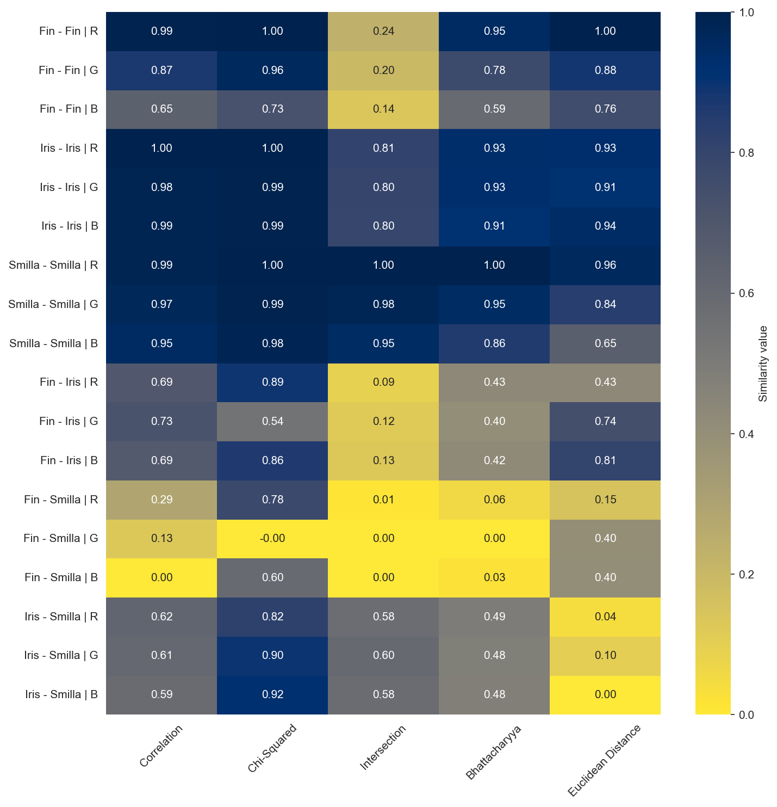

**Second Hypothesis:**
It is assumed that a thorough assessment of image data prior to training could predict which labels will be hardest to distinguish.
 - The images in each label were analyzed using Mean, Variance, and histogram comparison. The methods Correlation, Chi-Squared, Intersection, Bhattacharyya, and Euclidean Distance were applied to translate the histogram comparison results into similarity values.
   - **Validation:**
     - After visually comparing the average difference images, a preliminary conclusion pointed to “fin” and “smilla” being the most distinguishable, seeing as their difference image exhibited the most light patches and therefore the most difference. However, the difference images for the other two pets could not be satisfactorily assessed in that manner.

        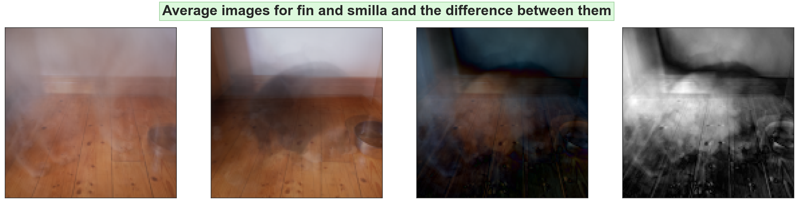

     - Next, Mean and Variance values were calculated for the difference images, yielding the following results:

            Mean for ('fin', 'iris'):       0.08560952
            Mean for ('fin', 'smilla'):     0.14524248
            Mean for ('iris', 'smilla'):    0.0888353

            Variance for ('fin', 'iris')    0.007388024
            Variance for ('fin', 'smilla')  0.010799234
            Variance for ('iris', 'smilla') 0.004014944

        While the Mean values were inconclusive for “fin – iris” and “iris – smilla”, the Variance values representing the variance for each pixel in the Mean images started to show a clear trend, with “iris – smilla” showing the least variance (0.004), followed by “fin – iris” (0.0074) and finally with “fin - smilla” peaking at 0.01. This trend has clearly been corroborated by the misclassification summary shown above.
    - To drill down even more, histogram comparison methods were applied. A scale of 0-1 was set to represent the degree of similarity, with 0 meaning “less similar” and 1 meaning “more similar”. The resulting comparison values were normalized using that scale relative to baseline values, which were calculated by splitting the images of each label in half and comparing the respective Mean images to each other.
    
    **Results by method:**
    - The Correlation method computes the correlation coefficient between two histograms, measuring the strength of a linear relationship between two histograms. It answers the question “How well can one histogram be predicted from another?”
        - The respective values in the heatmap show the lowest correlation values for the “fin – smilla” pair, corroborating the trial results. The values for “iris – smilla” are slightly lower than the values for “fin – iris”, which seems to contradict the actual trial results.
    - Chi-Squared measures the similarity between two histograms by calculating the sum of the squared differences normalized by the values of the histograms. This method is sensitive to small changes in the histogram bins.
        - The method pointed out a start dissimilarity in the Green channel of the “fin – smilla” pair but was inconclusive regarding the other pairs and channels and did not corroborate the trial results.
    - Intersection calculates the sum of the minimum values of corresponding bins in two histograms.
        - The values yielded by this method seem to corroborate the actual trial results, placing the pairs in the right order on the similarity scale. However, the method also points to low similarity between the “fin” baseline images, which might be a sign for too much variance within the “fin” label or imply that this method is too sensitive to yet unknown factors in our datasets.
    - The Bhattacharyya distance quantifies the overlap between two probability distributions. It is useful for comparing two probability histograms and provides a measurement of the distance between two distributions.
        - This method seems to corroborate the actual trial results, placing the “fin – smilla” pair at the very bottom of the similarity scale and the other pairs in the correct order slightly apart from each other.
    - Euclidean Distance measures the straight-line distance between corresponding bins in two histograms. It sums the squared differences of each bin and takes the square root. The smaller the distance, the more similar the histograms are.
        - This method doesn’t seem to reflect the trend shown by the actual trials, pointing to less difference between “smilla” and “iris” than between “smilla” and “fin”.

In conclusion, **Intersection** and **Bhattacharyya** were identified as the only two methods accurately reflecting the trial results. Whether there is a quantifiable correlation should be investigated in a separate study using a large dataset with pet images exhibiting various degrees of similarity.

### Deep Learning Classification Hypothesis:

- An F1 score of > 0.9 for test and live data is possible for each label.
    - A model architecture suited for multiclass image classification was chosen and a tuner was used to find the best hyperparameters. The model was then be trained with those parameters and used to classify all the available test and live data separately. After a long process of tuning and training different models, an F1 score of > 0.94 was reached for each label and deemed sufficient. Above that, neither the recall nor the precision values fall below 0.92.
- It is assumed that it is possible to reduce the risk of misclassifying a pet by letting the model make a summary prediction for a batch of images instead of trying to classify a pet based on one single image. It is also assumed that a minimum threshold value is needed for the number of images to be batched before the first classification attempt should be made.
    - A long series of trials was conducted where the model made predictions for batches of 2+n random live images for each label. The target F1 score for batch classification was set at 1. The results are as follows:
    
    **Setup:**
    
    A script aggregated all live images of a label and yielded them in random combinations of 2+n images (a batch) to the classifier function. The classifier function calculated the mean probabilities for the batch and returned the dominant class without a confidence threshold to consider, meaning that any probability > 0.34 would result in a classification.
    
    The following boxplot graphs exemplify the final model’s results for 50 batches at a time.

    Each batch consists of a given 2+n number of probability values for a specific class, as returned by the model. The box represents the upper and lower quartiles separated by the green median marker, while the red marker shows the mean value that we use for the classification. The circles represent outliers.

    Fin, 50 batches, 2 images each:
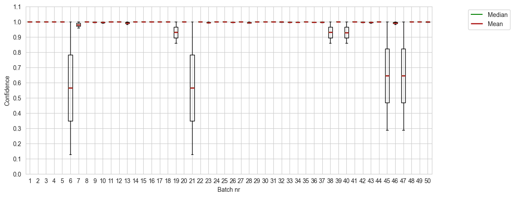
    Iris, 50 batches, 2 images each:
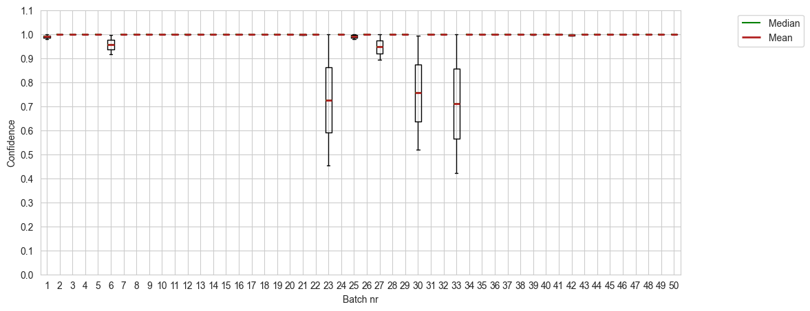
    Smilla, 50 batches, 2 images each:
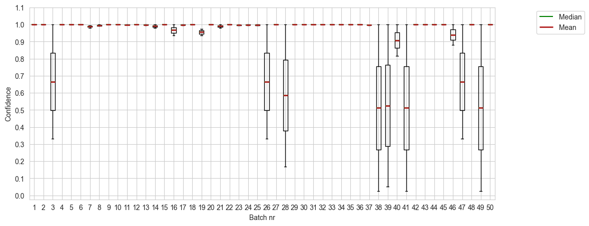

    Fin, 50 batches, 5 images each:
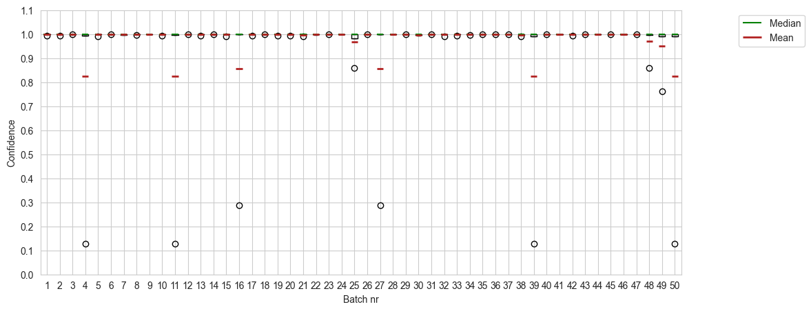
    Iris, 50 batches, 5 images each:
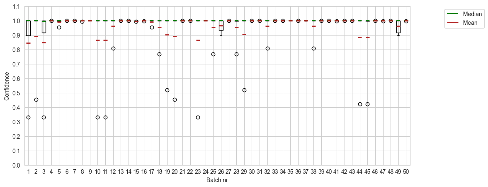
    Smilla, 50 batches, 5 images each:
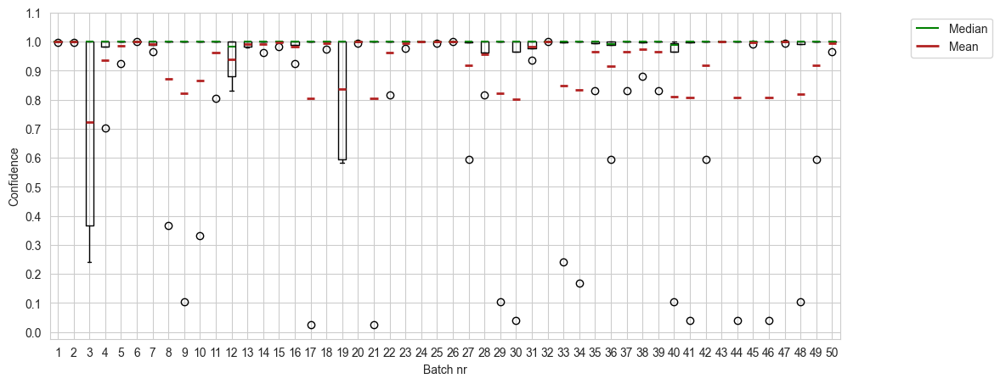

    Fin, 50 batches, 15 images each:
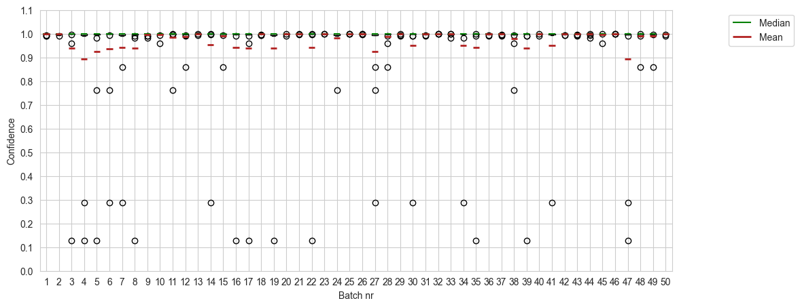
    Iris, 50 batches, 15 images each:
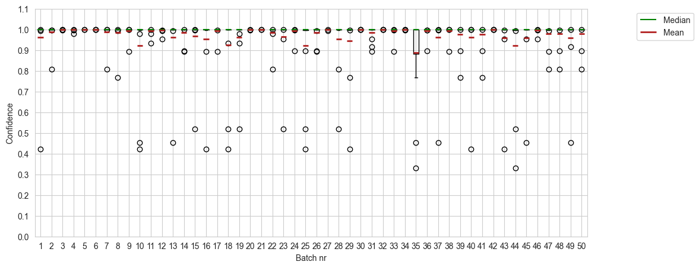
    Smiilla, 50 batches, 15 images each:
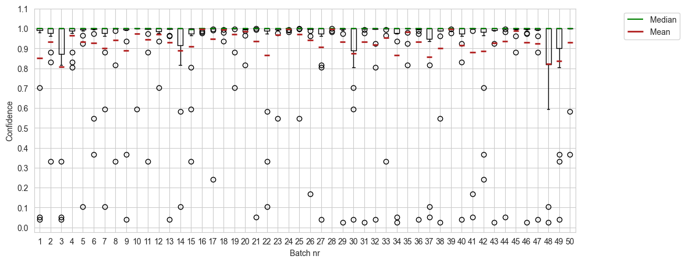

    As seen clearly on the figures, the red mean marker ascends with increasing batch size.

    For 2-image batches, some means are located around 0.5.
    For 5-image batches, the means are all above 0.7.
    For 15-image batches, the means are all above 0.8, with most being situated above 0.9.

    This trial was repeated multiple times with 500-1000 batches and 2-15 images per batch.
    No confidence threshold was set.
    To summarize the findings:
    Batches of 4 or fewer images tend to misclassify at least one batch every 500 runs.
    Batches of 5 or more images have not shown any misclassification for an entire batch.

    

    
Show Log

        #######################################################################
        ... Made predictions for 1000 batches with 3 images per batch.
        #######################################################################

        Analyzed 3000 images per label in total.
        Errors during individual image classification:

        Misclassified as          FIN         IRIS       SMILLA
        -------------------------------------------------------------
        iris                     56.0          nan        153.0
        smilla                    nan        101.0          nan
        fin                       nan         42.0         25.0

        Errors during batch classification:

        Confusion matrix: 

                        Predicted fin  Predicted iris  Predicted smilla
        Actually fin              1000               0                 0
        Actually iris                0             999                 1
        Actually smilla              2               7               991

        Classification report: 

                    precision    recall  f1-score   support

               fin       1.00      1.00      1.00      1000
              iris       0.99      1.00      1.00      1000
            smilla       1.00      0.99      0.99      1000

          accuracy                           1.00      3000
         macro avg       1.00      1.00      1.00      3000
      weighted avg       1.00      1.00      1.00      3000

        #######################################################################
        ... Made predictions for 500 batches with 5 images per batch.
        #######################################################################

        Results for FIN:

        Overall class prediction for all batches: FIN
        Overall confidence for all batches: 0.9780140038728714
        #######################################################################
        ... Made predictions for 500 batches with 5 images per batch.
        #######################################################################

        Results for IRIS:

        Overall class prediction for all batches: IRIS
        Overall confidence for all batches: 0.9749540005922317
        #######################################################################
        ... Made predictions for 500 batches with 5 images per batch.
        #######################################################################

        Results for SMILLA:

        Overall class prediction for all batches: SMILLA
        Overall confidence for all batches: 0.9387460021972657

        Errors during individual image classification:

        Misclassified as          FIN         IRIS       SMILLA
        ------------------------------------------------------------
        iris                     52.0          nan        122.0
        smilla                    nan         50.0          nan

        Errors during batch classification:

        Confusion matrix: 

                         Predicted fin  Predicted iris  Predicted smilla
        Actually fin               500               0                 0
        Actually iris                0             500                 0
        Actually smilla              0               0               500

        Classification report: 

                       precision    recall  f1-score   support
 
                 fin       1.00      1.00      1.00       500
                iris       1.00      1.00      1.00       500
              smilla       1.00      1.00      1.00       500

            accuracy                           1.00      1500
           macro avg       1.00      1.00      1.00      1500
        weighted avg       1.00      1.00      1.00      1500

        #######################################################################
        ... Made predictions for 500 batches with 5 images per batch.
        #######################################################################

        Results for FIN:

        Overall class prediction for all batches: FIN
        Overall confidence for all batches: 0.9821140050888062
        #######################################################################
        ... Made predictions for 500 batches with 5 images per batch.
        #######################################################################

        Results for IRIS:

        Overall class prediction for all batches: IRIS
        Overall confidence for all batches: 0.969705999970436
        #######################################################################
        ... Made predictions for 500 batches with 5 images per batch.
        #######################################################################

        Results for SMILLA:

        Overall class prediction for all batches: SMILLA
        Overall confidence for all batches: 0.9449200037717819

        Errors during individual image classification:

        Misclassified as          FIN         IRIS       SMILLA
        --------------------------------------------------------------
        iris                     43.0          nan        107.0
        smilla                    nan         76.0          nan

        Errors during batch classification:

        Confusion matrix: 
        
                         Predicted fin  Predicted iris  Predicted smilla
        Actually fin               500               0                 0
        Actually iris                0             500                 0
        Actually smilla              0               0               500

        Classification report: 

                      precision    recall  f1-score   support

                 fin       1.00      1.00      1.00       500
                iris       1.00      1.00      1.00       500
              smilla       1.00      1.00      1.00       500

            accuracy                           1.00      1500
           macro avg       1.00      1.00      1.00      1500
        weighted avg       1.00      1.00      1.00      1500

        Analyzed 2500 images per label in total.
        Errors during individual image classification:

        Misclassified as          FIN         IRIS       SMILLA
        ---------------------------------------------------------------
        iris                     62.0          nan        136.0
        fin                       nan         26.0         27.0
        smilla                    nan         81.0          nan

        Errors during batch classification:

        Confusion matrix: 

                         Predicted fin  Predicted iris  Predicted smilla
        Actually fin               500               0                 0
        Actually iris                0             500                 0
        Actually smilla              0               0               500

        Classification report: 

                        precision    recall  f1-score   support

                  fin       1.00      1.00      1.00       500
                 iris       1.00      1.00      1.00       500
               smilla       1.00      1.00      1.00       500

             accuracy                           1.00      1500
            macro avg       1.00      1.00      1.00      1500
         weighted avg       1.00      1.00      1.00      1500

        #######################################################################
        ... Made predictions for 500 batches with 4 images per batch.
        #######################################################################

        Results for FIN:

        Overall class prediction for all batches: FIN
        Overall confidence for all batches: 0.9790900027751923
        #######################################################################
        ... Made predictions for 500 batches with 4 images per batch.
        #######################################################################

        Results for IRIS:

        Overall class prediction for all batches: IRIS
        Overall confidence for all batches: 0.9665620005130768
        #######################################################################
        ... Made predictions for 500 batches with 4 images per batch.
        #######################################################################

        Results for SMILLA:

        Overall class prediction for all batches: SMILLA
        Overall confidence for all batches: 0.9400540025234222

        Errors during individual image classification:

                            fin  iris  smilla
        Misclassified as
        iris              41.0   NaN   105.0
        smilla             NaN  66.0     NaN

        Errors during batch classification:

        Confusion matrix: 

                        Predicted fin  Predicted iris  Predicted smilla
        Actually fin               500               0                 0
        Actually iris                0             500                 0
        Actually smilla              0               1               499

        Classification report: 

                       precision    recall  f1-score   support

                  fin       1.00      1.00      1.00       500
                 iris       1.00      1.00      1.00       500
               smilla       1.00      1.00      1.00       500

             accuracy                           1.00      1500
            macro avg       1.00      1.00      1.00      1500
         weighted avg       1.00      1.00      1.00      1500

    

    The goal now is to determine:
    -	an optimal minimum batch size that will make sure that an incorrect high-confidence error will not result in the misclassification of the batch,
    -	a reasonable confidence value that will make batch misclassification highly unlikely while avoiding false negatives for classes with the lowest recall,
    -	and an appropriate upper limit for the batch size after which an accurate classification should be guaranteed or the trial abandoned due to inconclusive input.

    After running 500 trials per preset confidence threshold and batches with min 3 and max 15 images, the following data has been collected:

    **80%:**
    | | min batch | max batch | classified after min | min proba | NaNs after 15 | misses |
    |---|---|---|---|---|---|---|
    | Fin	|  3	|	12	|	473	|		0.8 | - | - |
    | Iris |		3 |		4 |		488 | 			0.8 | - | - |
    | Smilla	|	3	|	13	|	398	|		0.78	|	1 | - |

                         
    **70%:**
    | | min batch | max batch | classified after min | min proba | NaNs after 15 | misses |
    |---|---|---|---|---|---|---|
    | Fin	|	3 |		6 |		498 |			0.71 | - | - |
    | Iris |	3 |	5 | 		497 |			0.71 | - | - |
    | Smilla |		3	|	11	|	458	|		0.71 | - | - |		

    **60%:**
    | | min batch | max batch | classified after min | min proba | NaNs after 15 | misses |
    |---|---|---|---|---|---|---|
    | Fin	|	3 |		3 |		500 |			0.63 | - | - |
    | Iris |		3 |		3 |		500 |			0.61 | - | - |
    | Smilla |		3 |		5 |		496 |			0.61 |	- |	1 – Iris 0.6 |
   
---
At a confidence threshold of 60%, after 3 images, “smilla” was misclassified as “iris” at a probability of 0.6 once during 500 trials. 
At a confidence threshold of 80%, after 15 images, “smilla” was not classified at all due to a mean probability of 0.78 once during 500 trials. 
At a confidence threshold of 70%, after 3-11 images, all pets were classified correctly with a mean probability of 0.71 during 500 trials.

Based on these results, the client received the following recommendation: 
Factoring in an adequate margin of safety, the minimum batch size should be at least **5 images**, the maximum batch size **15 images**, and the confidence threshold **70%**. 
This is deemed sufficient to substantially reduce the risk of misclassification while ensuring that the pet with the lowest recall value still gets identified within a short amount of time.

The last trial addresses the possibility of the model receiving a stream of mixed, inconclusive images, in which case it should cancel the classification. This functionality was simulated by feeding the model random images from all three labels and logging the results.

    Attempts | Pred. class | Actual majority class | Final confidence  
       nan    smilla?          smilla, 7 /15          0.47  
       nan     iris?             iris, 6 /15           0.4  
         5     smilla           smilla, 4 /5          0.79  
       nan    smilla?          smilla, 7 /15          0.45  
         5     smilla          smilla, 5 /5            1.0  
       nan     fin?               fin, 8 /15          0.53  
       nan    iris?            smilla, 7 /15          0.38  
       nan    iris?            smilla, 8 /15           0.4  
       nan     iris?             iris, 6 /15          0.41  
       nan    smilla?          smilla, 6 /15           0.4  
       nan     iris?             iris, 6 /15          0.46  
       nan     iris?             iris, 6 /15          0.45  
       nan     iris?             iris, 6 /15          0.39  
       nan     iris?             iris, 6 /15           0.4  
       nan    smilla?          smilla, 8 /15          0.53  
         5    smilla           smilla, 4 /5           0.84  
       nan     iris?             iris, 9 /15          0.59  
       nan     fin?               fin, 6 /15           0.4  
       nan    iris?            smilla, 6 /15          0.36  
       nan     iris?             iris, 6 /15           0.4  
         5      fin                fin, 4 /5   	      0.77	
       nan     fin?               fin, 6 /15           0.4  
       nan     fin?               fin, 6 /15           0.4  
       nan     iris?             iris, 7 /15          0.53  
       nan    iris?            smilla, 5 /15          0.37  
       nan     fin?               fin, 5 /15          0.33  
       nan    smilla?          smilla, 6 /15          0.39  
         5    smilla            smilla, 4 /5           0.8  
       nan     fin?               fin, 6 /15           0.4  
       nan     fin?               fin, 9 /15           0.6  
       nan     fin?               fin, 8 /15          0.53  
         5      iris              iris, 4 /5   	       0.8
       nan    fin?             smilla, 5 /15          0.33  
       nan     smilla?            fin, 6 /15           0.4  
       nan     iris?             iris, 9 /15          0.56  
         5       fin               fin, 4 /5   	       0.8
       nan    smilla?          smilla, 7 /15          0.43  
       nan     iris?              fin, 5 /15          0.38  
         5      iris              iris, 3 /5   	       0.9
       nan     iris?             iris, 8 /15          0.58  
         5       fin               fin, 5 /5           1.0
       nan     smilla?           iris, 6 /15          0.38  
       nan    smilla?          smilla, 7 /15          0.47  
       nan     iris?             iris, 7 /15          0.51  
         5      iris              iris, 3 /5          0.77  

    

## Design document

**Page 1: Quick Project Overview**

This page provides a quick project overview.

- Project summary
- Link to additional information ([Readme file](https://github.com/RikaIljina/PP5/main/README.md))
- <a href="https://drive.usercontent.google.com/u/0/uc?id=1M4vruKofgkxSTwYd1FCdtoajfvmZFP6Y&export=download" 
                target="_blank" rel="noopener">Live images</a>
- <a href="https://drive.usercontent.google.com/download?id=1jDeB3UaS86FiSKJnJ4Q5-n01PZ2Fq-zr&export=download" 
                target="_blank" rel="noopener">Train, Test, Validation datasets</a>
 - Description of the business requirements

**Page 2: Dataset Assessment**

This page will answer business requirement 1 by analyzing the dataset and providing a recommendation.
  - Checkbox 1 - Average and variance images for each label
  - Checkbox 2 - Differences between averages for each label combo
  - Checkbox 3 - Histogram comparison
  - Checkbox 4 - Metrics analysis
  - Checkbox 5 - Conclusions and recommendations for dataset compilation
  - Checkbox 6 - Image Montage

**Page 3: Image Classifier**

This page will answer Business requirements 2 and 3 by providing a tool for live image classification and returning the predicted and their scores.

Page features:

- Create a user interface with a file uploader widget:
    
    The user will have the option to adjust the parameters for the image stream classification. They can specify the number of trials to run, the minimum batch size for each trial, the cutoff value for each classification attempt, and the confidence threshold needed for accepting the final classification.
    
    The user can then upload single images or image batches and start the classification.

- Show a reel with the analyzed images, individual results, and the results per trial
- Show a table with all trials, the determined classes and the reached confidence values
-  Show a table with a summary of all classes that have been recognized in the image stream by the model.
- Allow the user to download the tables as csv file

**Page 4: Project Hypothesis and Validation**

This page recaps each project hypothesis, describes the conclusion and how it was validated.

**Page 5: ML Prediction Metrics**

This pages summarizes the model scores and evaluates its performance. The conclusions shown on this page lend support to answering business requirement 1 by corroborating or refuting the conclusions from the visual analysis and the initial assumptions.

Page features:

- Label Frequencies for Train, Validation, and Test Sets
- Model History - Accuracy and Losses
- Model evaluation result
- Conclusions and recommendations for classification parameters

https://www.datascience-pm.com/crisp-dm-2/

## CRISP-DM Process

This project applied the CRISP-DM methodology to provide a structured approach the data mining project.

**Description of the dataset applying the 6 CRISP-DM methodology**

A. Business Understanding
1. Determine business objectives:

    The client wants a PoC model that will accurately classify three specific pets while those are walking past the camera and coming up to their feeding bowl.
2. Assess situation:
    
    The result should be a small-scale, resource-effective model that can be run on an offline device. The required dataset can be limited to a few hundred images.
3. Determine data mining goals:
    
    The project is a success if the model can classify pet images in batches from a live data stream with an F1 score of > 0.9 for each label, does not misclassify a pet within a specified parameter scope and does not fail to classify a pet after analyzing the maximum image batch of viable mages.
4. Produce project plan:
    
    For this project, a Huawei P20 smartphone camera will suffice for the data collection. The data will be standardized, cleaned, and processed for training on an Asus ROG G751JT Notebook with an Intel Core i7-4710HQ CPU @ 2.50GHz and 16GB of RAM. Resource-heavy model tuning processes will be done using the limited free access to the Google Colab GPU runtime.

B. Data Understanding
1.	Collect initial data:
    
    The images were taken over the course of 3 days against a homogenous backdrop from roughly the same spot. 
2.	Describe data:

    1451 images were taken in total, with an extra 358 images taken on a different day to be used as independent live data. The images were taken as JPEGs with a Huawei P20 smartphone camera at a resolution of 7MP and a 1:1 aspect ratio. The images were resized to the format 128x128px and saved as 3-channel (RGB) PNG, with a bit depth of 8 bit per channel. The resizing was done in batch mode with the software IrfanView using Lanczos as filter.
3.	Explore data:
    
    Initial analyses were done using Mean and Variance representations and assumptions were made about the amount of similarity between datasets.
4.	Verify data quality:
    
    The data was intended to be a representation of the real-world data that will presumably be analyzed by the model. The images show the pets in different poses and are partly blurred or show only a partial view of the pet, which was a deliberate choice. A human can easily tell which pet is shown on the images.

C. Data Preparation
1.	Select data:
    
    All the pictures taken for this project were used for the model.
2.	Clean data:
    
    Images where only a small part of the pet was visible were deleted.
3.	Construct data:
    
    Average and variance images were created and compared using histogram comparison methods. The similarity between image sets was assessed with the help of the methods Correlation, Chi-Squared, Intersection, Bhattacharyya, and Euclidean Distance.
4.	Format data:
    
    The images were loaded as numpy arrays and converted to floats between 0 and 1. The consistency in size and number of channels was ascertained.
5.	Integrate data:
    
    The initially unbalanced data was balanced through undersampling and augmented by adding noise, cropping, brightness and hue variations.

D. Modeling
1.	Select modeling techniques:
    
    The CNN model will use the Softmax regression as the output layer activation function and the default ReLU activation function for all other layers. The optimal amount of filter layers and filter values as well as the number of neurons will be chosen after the hyperparameter tuning. Categorical cross-entropy, which is suitable for multi-class classification, will be used as the loss function, while Adam, being an efficient and resource-friendly algorithm, will be the optimizer.
2.	Generate test design:
    
    The images were spilt into train, test, and validation sets at a split rate of 0.6, 0.2, 0.2 respectively.
3.	Build model:
    
    Several models were built using various parameters. The tuning was performed with a variety of value ranges chosen mostly through trial and error.
4.	Assess model:

    Each model was thoroughly assessed on the basis of the Accuracy-Loss curves, its performance with test and live data, its F1 scores for each label, and its ability to yield an F1 score of 1 with the least amount of images over the course of hundreds of trial runs.

E. Evaluation
1.	Evaluate results:
    
    Several of the models did in fact perform well enough to be a reliable classifier for the specific task at hand (assessing a stream of 10-15 images before coming to a conclusion). However, the training process was repeated until the results were convincing even for small image batches (4-5 images) and consistently accurate over hundreds of trials.
2.	Review process:
    
    Some models were excluded due to their size even though their performance was meeting all the targets. Since it was decided that the model should be lightweight and 20MB at maximum, well-performing models with 70 MB and more had to be shelved. Certain models were rejected despite having F1 scores over 0.9 because the recall for one of the classes was unacceptably low.
3.	Determine next steps:

    The designed model is deemed appropriate to serve at the core of this Proof-of-Concept tool. The next step would be to identify common sources of misclassification, collect new images similar to those causing the issues, and retrain the mode. Considering the client’s need for an automated process for collecting training data, an in-depth study for image analysis and comparison is advisable. During that study, a multitude of image analysis and comparison methods should be researched and the correlation between the methods’ results and the performance of an image set mapped. Following that, the client could implement an image analysis tool that would allow a potential user to make a preliminary assessment of the product’s usefulness by analyzing batches of their pet’s images, and instruct a product user setting up their device on how to improve the odds of a successful classification of all pets.

F. Deployment
1.	Plan deployment:

    The deployment for this specific PoC tool was accomplished by designing a Streamlit dashboard, presenting all findings to the client in an easy-to-understand manner and connecting the model for live classification tests.
2.	Plan monitoring and maintenance:
    
    The dashboard and the model will be maintained and kept online for as long as the client requires it for testing and prototyping.
3.	Produce final report:

    The summary of all findings can be found on the dashboard. A separate file with detailed test results for selected models will be provided for download.
4.	Review project: …

## Bugs and Issues

## Deployment

## Technologies

## Credits